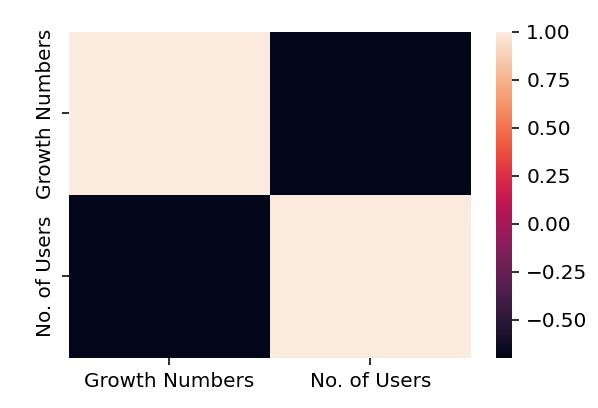

# 

## Project (GroupB) - GymPay
Minimizing transaction, operational and admin costs by utilising blockchain technology for fitness centres and professionals with a SaaS application called GymPay.

## Getting Started
Using the chrome browser for best viewing, view the dashboard using the link below:

https://nbviewer.org/github/Dottie-Doutre/GymPay/blob/sub/gympay_analysis.ipynb

The dashboard is embedded for you to navigate between the tabs outlining our findings.

The code in which was used to generate the dataframes, charts and conclusions are displayed below.

## Built With
Jupyter-lab

Python

Panel (Pygal, numpy, seaborn, hvplot, matplotlib, plotly.express)

## Research Questions
What is the market demographic?
```
Age, Use Frequency, Crypto User, Smartphone Use
```
What is the market size and oppurtunity?
```
Australia, Addressable Market (Total and Serviceable)
```
What is the competitive landscape?
```
Existing Providers, Cost/Benefit for fitness centres, Cost/Benefit for Gym members
```
## Summary of findings
> Increase in smartphone users and cryptocurrency adoption, with a strong negative linear relationship via correlation analysis.

> There is a steady increase of gym establishments in Australia, with most of the age group demographic within the 25 up to 44 years dominating the use of gyms. 
Addressing a large portion of the Australian population as a serviceable market.

> The combination of increasing gym establishments, cryptocurrency adoption and smartphone users, presents GymPay as a valuable SaaS application that will benefit both gyms and customers as presented in the cost benefit analysis.

> Cost savings of GymPay as a solution is 124x cheaper than existing solutions.

## Breakdown of analysis

### What is the Market Demographic?
Analysed the market demographic to help us understand our target market as to help achieve a product/market fit.

Data source utilised - finder.com.au
```
Created dataframes (crypto_df, smart_df) by reading in csv files.

Created dataframe (crypto_smart_phone) by concatinating that combination of the two dataframes mentioned perviously.

Calculate correlation of crypto_smart_phone dataframe (produced a table and heatmap). Used a define function = correlation_table_function and total_opts_table_function.

Created a pn.pane using Matplotlib to add to dashboard.
```
Conclusion:

There is a steady increase in both crypto and smartphone users.

Through our analysis we concluded a correlation factor of -0.69, leaning towards a more negative linear relationship. This indicates for the time being there is a strong relationship between the two factors trending in a negative slope.

But there is a potential for growing market for gym users and the utility use of GymPay.



### What is the Market Size Opportunity?
This section of the analysis was to determine the size of the market and opportunity. Also to calculate the scale for a potential startup for investors and founders.

Data source utilised - Kaggle
```
Created dataframes (gym_est_df) by reading in csv files.

Used a new library function not currently explored (pygal) to create a bar graph.
```
Conclusion:
There is a great opportunity to utlise and scale the application. As it is steadily increasing every year. The total addressiable market (TAM) of 6.8 gym users averaging about 3 gym sessions a week. 

Equating to 20,400,000 transactions a week, 2,900,000 transactions a day on a pay as you go basis.

With this finding the serviceable addressabe market is approximately 72% of TAM fit into the age category of 15-55.


### What is the existing alternative?
This section was to understand the competitive landscape that can allow GymPay to innovate on points of weakness with the current competition.
Data source utilised - Statista
```
Created dataframes (total_ops_df) by reading in csv files.

Used hvplots (stacked and line) to outline the difference in total cost comparison between businesses and Hedera (cryptocurrency used as an example) via transactional occurences.
```
Conclusion:

GymPay cost savings advantage will scale with size.

Cost savings of Hedera (cryptocurrency example) scale linearly against all current payment methods.

As an example with 100,000 transactions using the Hedera blockchain network, the gym owner would save $174,000.


 
## Example Analysis Graphs


## Versioning
Two main branches used for version control.
Main and sub.

The team utilised the "sub" branch to input changes created before pushing into the main branch.

## Contributing Sources
Finder.com.au

Kaggle (Data Science platform by Google)

Statista (Market and consumer data aggregator)

Australian Burea of Statistics

Fitness Australia (Independent Research Agency)

Blockchain.com

## Authors
Anthony Mura

Paaras Dhaliwal

Dorothy Doutre
